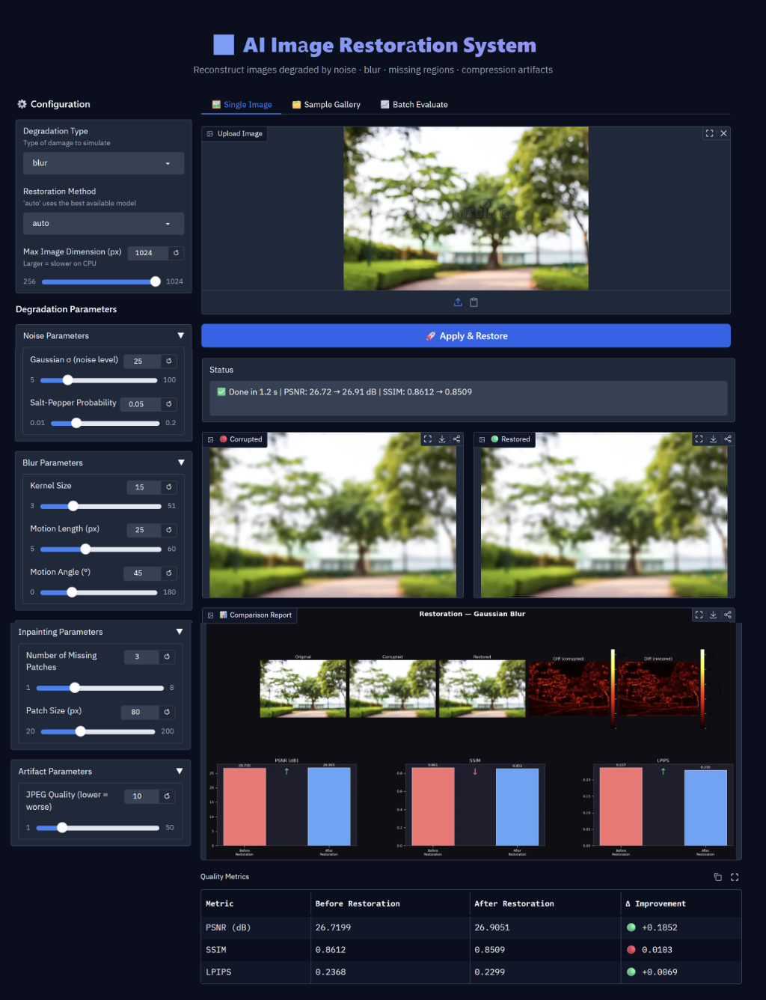
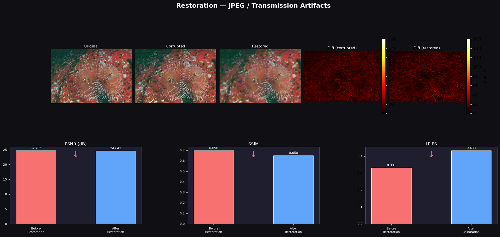

# 🖼️ AI-Based Image Restoration System

[](https://ai-image-restoration-zane.onrender.com/)
[](https://github.com/Ranker-AdhipKumar/AI-image-restoration)

A modular deep learning + classical CV pipeline that reconstructs images degraded by **noise**, **blur**, **missing regions**, and **compression artifacts** — with a full **Gradio web UI**, **CLI**, and quantitative evaluation via **PSNR**, **SSIM**, and **LPIPS**.



---

## ✨ Features

- **4 degradation types** with tunable parameters
- **Cascading restoration architecture** — state-of-the-art DL models with automatic fallback to classical methods
- **3 image quality metrics**: PSNR (signal fidelity), SSIM (structural similarity), LPIPS (perceptual)
- **Gradio web UI** with single-image, sample gallery, and batch evaluation tabs
- **CLI** supporting single-image and directory batch processing
- **Matplotlib comparison dashboard**: side-by-side panels + pixel difference heatmaps + metric bar charts
- **44 benchmark sample images** downloadable out of the box (Kodak, CBSD68, synthetic)

---

## 🧠 Model Architecture

Each degradation type has a **primary DL model** with graceful fallbacks:

| Degradation | Primary Model | Fallback |
|---|---|---|
| Noise | NAFNet-SIDD / DnCNN (pretrained) | BayesShrink Wavelet → OpenCV NLM |
| Blur | NAFNet-GoPro (pretrained) | Wiener Deconvolution → Richardson-Lucy |
| Missing Regions | LaMa Inpainting | Navier-Stokes → Telea FMM |
| JPEG Artifacts | DnCNN / NAFNet | TV Chambolle → OpenCV NLM |

**NAFNet** (Nonlinear Activation Free Network) — ECCV 2022, megvii-research — is implemented as a self-contained PyTorch module (`restoration/nafnet_arch.py`), with no dependency on `basicsr`.

---

## 📊 Sample Results



| Degradation | PSNR Before | PSNR After | SSIM Δ | LPIPS Δ |
|---|---|---|---|---|
| Gaussian Noise σ=25 | 20.28 dB | **22.69 dB** (+2.41) | +0.130 | — |
| Gaussian Blur k=15 | 21.00 dB | 20.84 dB | -0.026 | **-0.053** |
| Missing Regions | 13.67 dB | **23.72 dB** (+10.05) | +0.102 | **-0.100** |
| JPEG Artifacts Q=10 | 24.71 dB | 24.64 dB | -0.045 | +0.101 |

---

## 🚀 Quick Start

### 1. Clone & set up environment
```bash
git clone https://github.com/Ranker-AdhipKumar/AI-image-restoration.git
cd AI-image-restoration

python -m venv venv
# Windows:
.\venv\Scripts\pip.exe install -r requirements.txt
# Linux/Mac:
pip install -r requirements.txt
```

### 2. Download sample images
```bash
python sample_images/download_samples.py
```

### 3. Launch the Web UI
```bash
# Windows:
.\venv\Scripts\python.exe app.py

# Linux/Mac:
python app.py
```
Open **http://127.0.0.1:7860** in your browser.

---

## 💻 CLI Usage

```bash
# Denoise a noisy image
python main.py --input photo.jpg --degradation noise --sigma 30 --output results/

# Deblur
python main.py --input photo.jpg --degradation blur --kernel-size 15 --method wiener

# Fill missing regions
python main.py --input photo.jpg --degradation inpaint --n-patches 3 --patch-size 80

# Remove JPEG artifacts
python main.py --input photo.jpg --degradation artifact --quality 10

# Batch process a folder
python main.py --input ./sample_images --degradation noise --batch --output results/

# Print metrics as JSON
python main.py --input photo.jpg --degradation noise --json
```

### CLI Parameters

| Flag | Description | Default |
|---|---|---|
| `--degradation` | `noise`, `salt_pepper`, `blur`, `motion_blur`, `inpaint`, `artifact`, `mixed` | required |
| `--method` | `auto`, `nafnet`, `dncnn`, `wavelet`, `nlm`, `wiener`, `rl`, `lama`, `ns`, `telea`, `tv` | `auto` |
| `--max-dim` | Resize image so max dimension ≤ this value | `768` |
| `--sigma` | Gaussian noise level | `25` |
| `--kernel-size` | Blur kernel size | `15` |
| `--quality` | JPEG quality (1=worst, 50=moderate) | `10` |
| `--n-patches` | Number of inpainting mask patches | `3` |
| `--batch` | Process all images in input directory | `false` |
| `--json` | Output metrics as JSON to stdout | `false` |

---

## 🏗️ Project Structure

```
├── app.py                    # Gradio web UI (3 tabs)
├── main.py                   # CLI entry point
├── degradation.py            # 7 degradation simulators
├── metrics.py                # PSNR · SSIM · LPIPS
├── visualizer.py             # Matplotlib comparison figures
├── utils.py                  # I/O helpers, atomic weight downloader
├── restoration/
│   ├── __init__.py           # Unified restoration dispatcher
│   ├── nafnet_arch.py        # Self-contained NAFNet (no basicsr needed)
│   ├── denoiser.py           # Denoising cascade
│   ├── deblurrer.py          # Deblurring cascade
│   ├── inpainter.py          # Inpainting cascade
│   └── artifact_remover.py  # Artifact removal cascade
└── sample_images/
    └── download_samples.py   # Downloads Kodak, BSD68, DIV2K, synthetic images
```

---

## 📦 Dependencies

| Package | Purpose |
|---|---|
| `torch` + `torchvision` | Deep learning inference |
| `opencv-python` | Image I/O, classical restoration |
| `scikit-image` | PSNR, SSIM, wavelet denoising |
| `scipy` | Wiener / Richardson-Lucy deconvolution |
| `lpips` | Perceptual image quality metric |
| `gradio` | Web interface |
| `matplotlib` | Comparison figure generation |
| `Pillow`, `numpy` | Image arrays and I/O |

---

## 📖 References

- **NAFNet**: [Simple Baselines for Image Restoration](https://arxiv.org/abs/2204.04676), Chen et al., ECCV 2022
- **DnCNN**: [Beyond a Gaussian Denoiser](https://arxiv.org/abs/1608.03981), Zhang et al., TIP 2017
- **LaMa**: [Resolution-robust Large Mask Inpainting](https://arxiv.org/abs/2109.07161), Suvorov et al., WACV 2022
- **LPIPS**: [The Unreasonable Effectiveness of Deep Features as a Perceptual Metric](https://arxiv.org/abs/1801.03924), Zhang et al., CVPR 2018
- **SSIM**: [Image Quality Assessment](https://ece.uwaterloo.ca/~z70wang/publications/ssim.pdf), Wang et al., TIP 2004

---

## 📄 License

MIT License — feel free to use, modify, and distribute.
