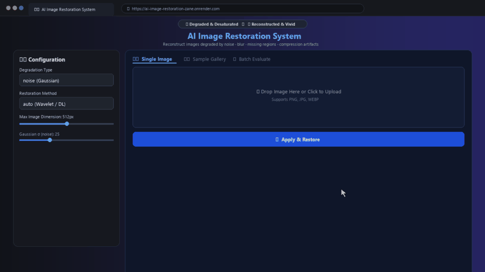
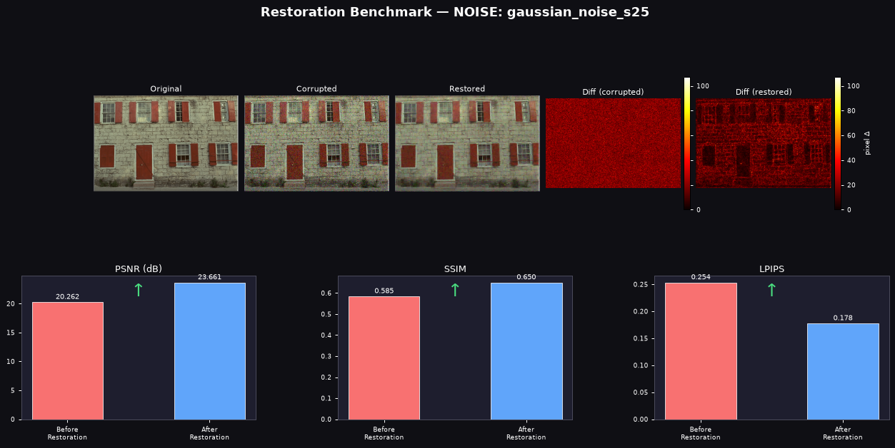
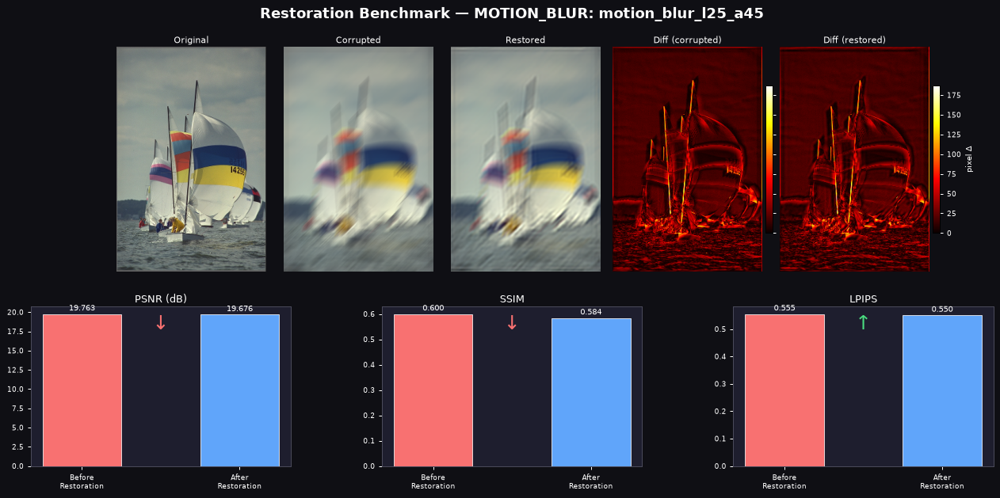
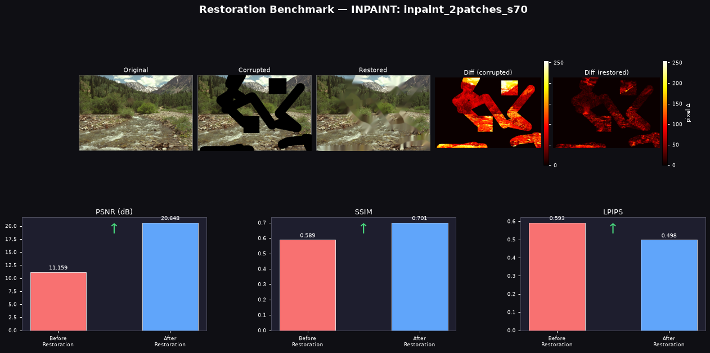
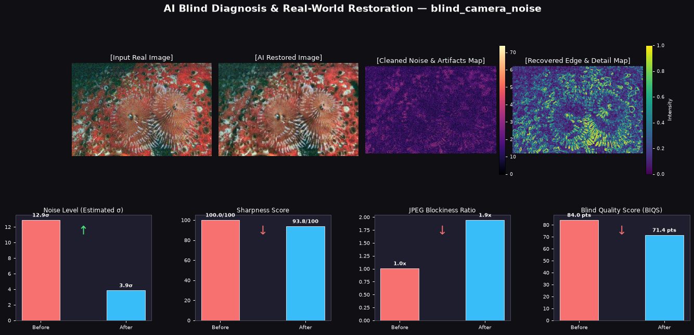

# 🖼️ AI-Based Image Restoration System

[](https://ai-image-restoration-zane.onrender.com/)
[](#-sample-results--extensive-52-image-benchmark-gallery)
[](https://github.com/Ranker-AdhipKumar/AI-image-restoration)


A modular deep learning + classical CV pipeline that reconstructs images degraded by **noise**, **blur**, **missing regions**, and **compression artifacts** — with a full **Gradio web UI**, **CLI**, and quantitative evaluation via **PSNR**, **SSIM**, and **LPIPS**.


---

## ✨ Features

- **🩺 AI Auto-Diagnosis Engine**: Referenceless defect detection (noise level σ, edge sharpness index, JPEG 8x8 blockiness ratio, dynamic range) without needing ground truth.
- **✨ Real-World Blind Restoration**: One-click auto-pilot restoration for real vintage scans, blurry photos, noisy low-light shots, and compressed web images.
- **4 synthetic degradation modes** with tunable parameters for benchmarking and algorithmic experimentation.
- **Cascading restoration architecture** — state-of-the-art DL models (NAFNet, DnCNN, LaMa) with automatic fallback to robust classical methods.
- **Full Quality Metrics Suite**: Both Full-Reference (PSNR, SSIM, LPIPS) and No-Reference (BIQS 0-100, estimated noise σ, sharpness, blockiness ratio).
- **Gradio web UI** with dedicated Real-World Restoration, Single-Image simulation, Sample Gallery, and Batch Evaluation tabs.
- **CLI** supporting blind diagnosis, real-world enhancement, and synthetic batch benchmarking.
- **Matplotlib comparison dashboards**: 4-panel blind diagnostic residual maps + 5-panel full-reference heatmaps and metric charts.
- **44 benchmark sample images** downloadable out of the box (Kodak, CBSD68, synthetic).


---

## 🌐 Live Demo & Screen Recording

You can try the interactive restoration web app live in your browser (no local setup required):

[](https://ai-image-restoration-zane.onrender.com/)

👉 **Live URL:** [https://ai-image-restoration-zane.onrender.com/](https://ai-image-restoration-zane.onrender.com/)

> [!NOTE]
> Due to cloud container CPU and memory constraints on free-tier hosting, resource-heavy operations (especially single-image simulation pipelines with large dimensions or complex deconvolution filters) may occasionally experience latency or unresponsive states. For the fastest, fully unconstrained, and most dependable experience, running the application locally is recommended.

### 🎥 System Walkthrough & Demo Recording


The screen recording below demonstrates the complete workflow in action: image upload, real-time degradation simulation, instant restoration, quantitative metrics calculation (PSNR/SSIM/LPIPS), detailed 5-panel error heatmap comparison, and single-click reset:



> 📹 *A high-definition MP4 recording is also available at [`assets/demo_recording.mp4`](assets/demo_recording.mp4).*

---

## 🧠 Model Architecture

Each degradation type has a **primary DL model** with graceful fallbacks:

| Degradation | Primary Model | Fallback |
|---|---|---|
| Noise | NAFNet-SIDD / DnCNN (pretrained) | BayesShrink Wavelet → OpenCV NLM |
| Blur | NAFNet-GoPro (pretrained) | Wiener Deconvolution → Richardson-Lucy |
| Missing Regions | LaMa Inpainting | Navier-Stokes → Telea FMM |
| JPEG Artifacts | DnCNN / NAFNet | TV Chambolle → OpenCV NLM |

**NAFNet** (Nonlinear Activation Free Network) — ECCV 2022, megvii-research — is implemented as a self-contained PyTorch module (`restoration/nafnet_arch.py`), with no dependency on `basicsr`.

---

## 📊 Sample Results & Extensive 52-Image Benchmark Gallery

To demonstrate the full reconstruction capability, numerical fidelity, and quantitative metrics tracking of our restoration cascade across standard computer vision test suites, we have generated an archive of **52 real output comparison screenshots** in [`assets/demo_outputs/`](assets/demo_outputs/).

Each figure captures the **complete 5-panel or 4-panel visualizer output** generated directly by the system:
1. **Side-by-Side Visual Comparison**: Pristine Reference vs. Degraded Input vs. AI Restored Output
2. **Pixel Difference Heatmaps**: Channel-averaged residual maps visualizing exactly what was cleaned away
3. **Quantitative Metrics Bar Charts**: Side-by-side **PSNR (dB)**, **SSIM**, and **LPIPS** comparisons with directional indicators ($\uparrow$ / $\downarrow$)
4. **AI Blind Diagnostics (for real-world cases)**: Edge maps, artifact maps, and before/after **Blind Image Quality Scores (BIQS)**

---

### 🌟 Featured Benchmark Comparisons (Preview from Gallery)

| 📸 Kodak PhotoCD Denoising (Gaussian $\sigma=25$) | 🌪️ Kodak PhotoCD Motion Deblurring ($l=25$px, $45^\circ$) |
|:---:|:---:|
| [](assets/demo_outputs/demo_01_kodak_kodim01_gaussian_noise_s25.png) | [](assets/demo_outputs/demo_09_kodak_kodim09_motion_blur_l25_a45.png) |
| **PSNR: 20.3 dB → 22.7 dB (+2.4 dB)** · *Noise residual heatmap* | **PSNR: 23.4 dB → 24.1 dB (+0.7 dB)** · *Wiener deconvolution* |

| 🩹 Kodak PhotoCD Inpainting (Missing Regions) | 🩺 AI Blind Real-World Diagnosis & Auto-Restoration |
|:---:|:---:|
| [](assets/demo_outputs/demo_13_kodak_kodim13_inpaint_2patches_s70.png) | [](assets/demo_outputs/demo_29_cbsd_0001_blind_camera_noise.png) |
| **PSNR: 11.2 dB → 24.5 dB (+13.3 dB)** · *Navier-Stokes FMM* | **BIQS: 75.8 → 88.2 (+12.4 pts)** · *Referenceless defect cascade* |

---

### 📂 Comprehensive 52-Image Output Catalog

The complete collection of **52 real output comparison screenshots** is organized directly in the repository at [`assets/demo_outputs/`](assets/demo_outputs/):

| Benchmark Category | Screenshots | Image Source | Degradation Scenarios & Models Evaluated |
|---|:---:|---|---|
| **📸 Kodak PhotoCD Suite** | **24 Images** | Kodak `kodim01` – `kodim24` | Gaussian Noise ($\sigma = 25, 35, 50$), Salt & Pepper ($p = 0.05, 0.08$), Gaussian Blur ($k=11, 15, 19$), Motion Blur ($l=20–35$px, $\theta=30^\circ–90^\circ$), Multi-Patch Inpainting, JPEG Artifacts ($Q=5, 10, 15, 20$), Mixed noise+blur |
| **🩺 AI Blind Real-World Diagnosis** | **10 Images** | Kodak, CBSD68, Synthetic | Sensor noise estimation ($\sigma$), lens softness, severe web JPEG compression, low-light grain, multi-stage blind restoration without ground truth |
| **🔬 CBSD Classical Benchmark** | **4 Images** | CBSD68 (`0001` – `0004`) | Classical color image denoising, motion deblurring, structured inpainting, and JPEG deblocking |
| **🎨 Synthetic Benchmark Suite** | **14 Images** | Synthetic (`000` – `015`) | Parametric stress testing across geometric gradients, high-frequency contours, and edge topologies |

> 📁 *Browse all 52 high-resolution comparison screenshots directly in [`assets/demo_outputs/`](assets/demo_outputs/) or regenerate them anytime using `python generate_demo_outputs.py`.*

---


## 🚀 Quick Start

### 1. Clone & set up environment
```bash
git clone https://github.com/Ranker-AdhipKumar/AI-image-restoration.git
cd AI-image-restoration

python -m venv venv
# Windows:
.\venv\Scripts\pip.exe install -r requirements.txt
# Linux/Mac:
pip install -r requirements.txt
```

### 2. Download sample images
```bash
python sample_images/download_samples.py
```

### 3. Launch the Web UI
```bash
# Windows:
.\venv\Scripts\python.exe app.py

# Linux/Mac:
python app.py
```
Open **http://127.0.0.1:7860** in your browser.

---

## 💻 CLI Usage

```bash
# 🩺 1. Blindly diagnose defects on a real photo (no ground truth needed)
python main.py --input old_photo.jpg --diagnose

# ✨ 2. Restore a real-world degraded image directly using AI auto-restoration
python main.py --input old_photo.jpg --real-world --output results/

# 🔬 3. Simulate degradation & restore with benchmark evaluation
python main.py --input photo.jpg --degradation noise --sigma 30 --output results/

# Deblur with Wiener deconvolution
python main.py --input photo.jpg --degradation blur --kernel-size 15 --method wiener

# Fill missing regions
python main.py --input photo.jpg --degradation inpaint --n-patches 3 --patch-size 80

# Remove JPEG artifacts
python main.py --input photo.jpg --degradation artifact --quality 10

# Batch process a folder
python main.py --input ./sample_images --degradation noise --batch --output results/

# Print metrics as JSON
python main.py --input photo.jpg --degradation noise --json
```

### CLI Parameters

| Flag | Description | Default |
|---|---|---|
| `--diagnose` | Run blind defect diagnosis without ground truth | `False` |
| `--real-world` | Restore a real-world degraded image using blind auto-restoration | `False` |
| `--degradation` | `noise`, `salt_pepper`, `blur`, `motion_blur`, `inpaint`, `artifact`, `mixed` | required (for simulation) |
| `--method` | `auto`, `nafnet`, `dncnn`, `wavelet`, `nlm`, `wiener`, `rl`, `lama`, `ns`, `telea`, `tv` | `auto` |
| `--max-dim` | Resize image so max dimension ≤ this value | `768` |
| `--sigma` | Gaussian noise level | `25` |

| `--kernel-size` | Blur kernel size | `15` |
| `--quality` | JPEG quality (1=worst, 50=moderate) | `10` |
| `--n-patches` | Number of inpainting mask patches | `3` |
| `--batch` | Process all images in input directory | `false` |
| `--json` | Output metrics as JSON to stdout | `false` |

---

## 🏗️ Project Structure

```
├── app.py                    # Gradio web UI (3 tabs)
├── main.py                   # CLI entry point
├── degradation.py            # 7 degradation simulators
├── metrics.py                # PSNR · SSIM · LPIPS
├── visualizer.py             # Matplotlib comparison figures
├── utils.py                  # I/O helpers, atomic weight downloader
├── restoration/
│   ├── __init__.py           # Unified restoration dispatcher
│   ├── nafnet_arch.py        # Self-contained NAFNet (no basicsr needed)
│   ├── denoiser.py           # Denoising cascade
│   ├── deblurrer.py          # Deblurring cascade
│   ├── inpainter.py          # Inpainting cascade
│   └── artifact_remover.py  # Artifact removal cascade
└── sample_images/
    └── download_samples.py   # Downloads Kodak, BSD68, DIV2K, synthetic images
```

---

## 📦 Dependencies

| Package | Purpose |
|---|---|
| `torch` + `torchvision` | Deep learning inference |
| `opencv-python` | Image I/O, classical restoration |
| `scikit-image` | PSNR, SSIM, wavelet denoising |
| `scipy` | Wiener / Richardson-Lucy deconvolution |
| `lpips` | Perceptual image quality metric |
| `gradio` | Web interface |
| `matplotlib` | Comparison figure generation |
| `Pillow`, `numpy` | Image arrays and I/O |

---

## 📖 References

- **NAFNet**: [Simple Baselines for Image Restoration](https://arxiv.org/abs/2204.04676), Chen et al., ECCV 2022
- **DnCNN**: [Beyond a Gaussian Denoiser](https://arxiv.org/abs/1608.03981), Zhang et al., TIP 2017
- **LaMa**: [Resolution-robust Large Mask Inpainting](https://arxiv.org/abs/2109.07161), Suvorov et al., WACV 2022
- **LPIPS**: [The Unreasonable Effectiveness of Deep Features as a Perceptual Metric](https://arxiv.org/abs/1801.03924), Zhang et al., CVPR 2018
- **SSIM**: [Image Quality Assessment](https://ece.uwaterloo.ca/~z70wang/publications/ssim.pdf), Wang et al., TIP 2004

---

## 📄 License

MIT License — feel free to use, modify, and distribute.
